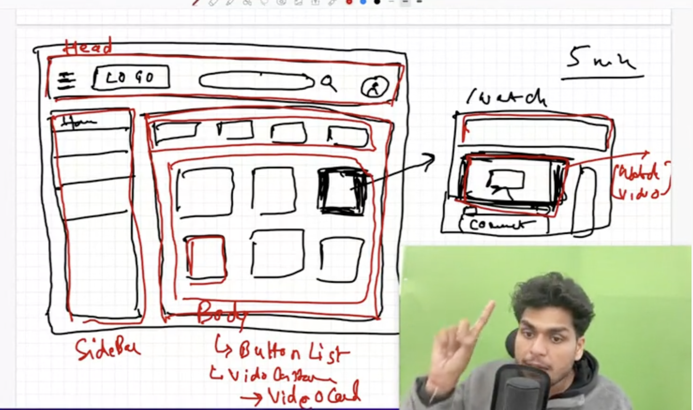

## Machine coding Interview

### Build Youtube application

- **Requirements clearificaton**

  - What features that we need to build
  - Tech-stack that we will use
    - Tailwind css
    - redux
    - React-router-dom for routing
    - what bundler we will be using

- **Now plan**

  - 

- **Now execution**

Step-1: Create a react app

```
$ npx create-react-app //We are executing create-react-app package
```

Step-2: Install tailwind and configure it

Step-3: Start writing code

-> Code Structure:

- Head
- Body
  - Sidebar
    - MenuItems
  - MainContainer
    - ButtonsList
    - VideoContainer
      - VideoCard

-> Now build redux-store:

- install redux-toolkit

```
$npm i @reduxjs/toolkit

$npm i react-redux
```

- create store.js inside utils folder

store.js

```
import { configureStore } from "@reduxjs/toolkit";

const store = configureStore({

});

export default store;
```

- create appSlice inside utils folder

```
import { createSlice } from "@reduxjs/toolkit";

const appSlice = createSlice({

});
```

- provide my redux-store to the app

App.js

```
import { Provider } from "react-redux";
import store from "./utils/store";

function App() {
  return (
    <Provider store={store}>
      <Head />
      <Body />
    </Provider>
  );
}
```

- go to head.js component for implementing toggle menu
  use dispatch
- go to sidebar.js
  use selector

- Let's build buttonList now

- Let's build videoContainer now

  - We will use api to show videos
    https://developers.google.com/youtube/v3/docs/videos/list

    - Put the api endpoint in constants.js file

    - Now render the api info in videoContainer

- Lets configue react-router-dom now

```
$ npm i react-router-dom
```

- let's build watch page(on clicking on any video thumbnail it should redirect to the video playing page) now

### What is higher-order-function

-> Its a function which takes in a component and returns a component

### Debouncing

(show flipkart searchbar )
-> Suppose I am typing something very fast, it just skips some of the events

- Build the search bar

- lets use youtube seacrh api

### Cache:

- time complexity to search in array =O(n)
  [i,ip,iph,iphone]
- time complexity to search in object =O(1)

{
i:
ip:
iph:
iphone:
}

- We can use **new map()** as well

- let's build comments section now
  n level nested comments

### Lets build live chat

**Challanges**

Data layer: Get data live

UI layer: Update the UI

**There are two to handle live data**

- Web sockets => Web socket is a two way connection established between server and UI (it is bi-directional).
  Once this handshake is established we can quickly send data from either sides
  e.g- Zerodha,Live chatting apps(whatsapp)

- API Polling => Here connection is uni-directional, UI will keep polling data from server at a regular interval
  e.g- Gmail,youtube live chats
